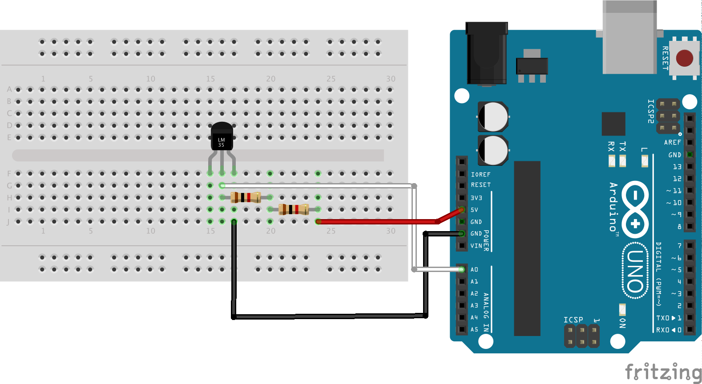

# NodeBots Day Scientist Kit

You have a nodebots kit which has been custom designed specifically
for NodeBots Day in order for you to get the most out of the day and build
interesting things.

Your kit should contain the following:

* Jumper wires
* 10K, 1K & 220 Ohm Resistor
* Potentiometer 10K
* Red, Green, Yellow, Blue & White LEDs
* RGB LED
* Breadboard
* Arduino Uno
* Mini Servo
* 74HC595 Shift Register
* Pushbuttons
* Photo Resistor
* Temperature Sensor
* Piezo buzzer
* LCD Screen
* NeoPixel Strip
* Sound sensor

As you can see - lots of things to play with, learn about and take further.

## Installation and setup

Start with the [installation process outlined here](https://github.com/nodebotsau/nbdau/blob/master/setup.md)
if you haven't already done so.

Clone this repository into a folder using:

```
git clone https://github.com/nodebotsau/scientist-kit.git
cd scientist-kit
```

### Install node dependencies.

From the repo folder then install the project files:

```
npm install
```

And all your dependencies will be installed.

Assuming you've had no issues, move onto the examples.

### Install the firmware to the arduino

To install the firmata firmware you'll need to talk to the arduino, you can
install it using [interchange](https://www.npmjs.com/package/nodebots-interchange).
Interchange is like a package manager or firmware written in JS and will have
been installed as part of your initial set up.

```
interchange install StandardFirmata -a uno
```

After a minute you should get notification about the firmware being flashed
and you're ready to get programming.

## Examples

These examples are very simple and have little explanation. They have been
compiled from the `johnny-five` docs and from `node-ardx` package. We recommend
you visit [Johnny Five](http://johnny-five.org) and [Node-ARDX](http://node-ardx.org)
for really detailed versions of these - and the specific examples are linked
to the appropriate location.

### Blink an LED

The hello world of hardware. [Look at the wiring instructions here](http://johnny-five.io/examples/)
for one of the most basic circuits you can make. The code is available at
[examples/led.js](examples/led.js).

Things to note:

* Pin 13 is special because it has a resistor attached to it which means you
won't blow up an LED by connecting it directly. If you want to use an LED on
any other pin, connect it with a resistor between the LED and the digital pin
on the arduino.

Run with:

```
node examples/led.js
```

And you should get a blinking LED.

Going further:

* Have diffrerent coloured LEDs light up for different interactions
* Use [PWM](https://en.wikipedia.org/wiki/Pulse-width_modulation) to make your
LED fade different colours. [Johnny Five has a good example](http://johnny-five.io/examples/led-fade/)

### Write text on an LCD

Want to write some text on a screen? Maybe you could use this to write out the
contents of a tweet, or how much you love NodeBots Day.

[The wiring instructions are here in the Johnny Five docs](http://johnny-five.io/examples/lcd/)

Note:

* Your potentiometer is bigger than the one in the diagram so leave a bit more
space for it.
* Pay attention to what is power and ground on the diagram versus how you wire it up

The code is available at [examples/lcd.js](examples/lcd.js)

Run with:

```
node examples/lcd.js
```

You should see some messages appear on the screen.

Going further:

* Update the screen periodically with a counter - maybe a countdown clock
* Make a "scrolling game" or just make your text scroll across the screen.
* Use the display to ask for input which you can then use buttons or potentiometers
to provide the details back.

### Make something move with a servo

Servos are great to make things move. In the kit is what's called a Standard Servo
and it will move 180 degrees in an arc. So you could use it to make something
wave, or pull a trigger or push something too.

[The wiring instructions are from the Johnny Five docs](http://johnny-five.io/examples/servo-prompt/)

Things to note:

* Servos aren't really accurate so don't expect to see perfect changes between
41 and 42 degrees. they are designed for high torque and big movements.
* Lots of servos will overload your arduino so if you are using more than 2 at
a time then consider a dedicated battery pack.

The code is available at [examples/servo.js](examples/servo.js)

Run with:

```
node examples/servo.js
```

When it runs you should be able to set values between 0 and 180 and hit enter
and your servo will move to that position.

Going further:

* Use the [Johnny Five animation library](http://johnny-five.io/examples/servo-animation/) in
order to provide keyframes and animate the motion.
* Get your servo to repond to some other stimulus such as receiving a message then
doing an action.

### Make a light display with neopixels

NeoPixels or WS2812 LEDs are individually controllable LEDs that come in a strip.
The wonderful thing about these LEDs is that they are both RGB so you can set
the colour but they are individually addressable. On the strip you have in your
kit you have 8 so you can set each one to be a separate colour.

[Detailed instructions are available from the node-pixel docs](https://github.com/ajfisher/node-pixel/blob/master/docs/installation.md#hardware-installation)

A simple wiring guide is below:


Things to note:

* The more updates you make to the strip the more data has to be processed best
to do all your processing JS side and then send the changes to the arduino when
you're ready to display.

The code is available at [examples/neopixel.js](examples/neopixel.js)

Run with:

```
node examples/neopixel.js
```

When it runs you should see some pixels chasing each other up the strip and
changing colour as they go.

Going further:

* Use the LEDs to react to something happening on your server such as load, memory etc
* Animate different patterns of LEDs for different meanings.

### Make some noise

The sound sensor is a very simple microphone that outputs an analog signal. In
Johnny Five this can be represented very simply as a `Sensor` object.

[Wiring instructions can be found in the Johnny Five docs](http://johnny-five.io/examples/microphone/)

Things to note:

* Use the F-M wires and connect to the back of the board. S is Signal and goes
to A0, G is Ground and goes to GND, V is voltage and goes to 5V.
* You can't really record something with this type of mic as it doesn't have
much range.

The code is available at [examples/sound.js](examples/sound.js)

Run with

```
node examples/sound.js
```

When it runs if you make some noise like clapping your hands you'll see the values
spike upwards.

Going further:

* Use the sound sensor for input and then use an LED or NeoPixel to indicate
how noisy things are.
* Use the sound sensor to raise or lower the volume of some music depending
on the ambient noise levels.

### Play that (squeaky) music....

A long term crowd pleaser at every NodeBots event is the Piezo buzzer. This little
bundle of squeaky goodness will play whatever high pitched squawky notes you can
throw at it.

[Here's the wiring diagram from Node-ARDX](http://node-ardx.org/exercises/6)

Things to note (if you pardon the pun):

* Piezo's aren't very loud so you need to be quiet to hear them properly.
* There is a + marked on one side, this goes to the pin, the other side goes to ground
* Piezo's only work on PWM pins - they are the ones marked with `~` on them

The code is available at [examples/piezo.js](examples/piezo.js)

Run with:

```
node examples/piezo.js
```

When it runs you should hear a really squeaky and possibly irritating "tune".

Going further:

* Make a jukebox that plays different tunes depending on someone's selection
* Play a tune depending on the outcome of an API
* Play "ta da!" when your grunt tasks have finished running.

### Is it cold in here or is it just me?

Temperature sensors are great place to start to start measuring environmental
variables as they are pretty accurate for such a small and cheap package. They
are pretty easy to set up too. Have a look at the wiring diagram below.



Things to note:

* Check the direction of the temperature sensor to make sure you have the pins
the right way around. Pins are determined by looking at the "face" of the sensor,
ie the bit with the writing on it and they go from left to right.
* The sensor requires a 2KΩ but you can use 2x1KΩ resistors in series as they
"add up" to 2KΩ when used together like this.
* The code we have here uses a custom controller. In Johnny-Five all components
use controllers so we have generalised classes such as `Temperature Sensor` and
we can then implement the details and drivers of these for each chip or different
sensor. The LM335 we are using measures directly in °K so needs the `toCelsius`
method provided to do that conversion.
* This circuit is what is known as a [Voltage Divider](https://en.wikipedia.org/wiki/Voltage_divider)
which are really useful for all kinds of sensor measurement circuits.

The code is available at [examples/temperature.js](examples/temperature.js)

Run with:

```
node examples/temperature.js
```

When the code runs you should see the temperature print out in °C, °F & °K.

Going further:

* Visualise temperature data by writing to a web app.
* Hook up an RGB LED or NeoPixel strip and visualise the temperature with colour

### Other components and what they do

The other components don't have specific examples but here are some notes around them:

* An RGB LED is simply a red, green and blue LED in one package. Wire it up to
three digital pins and change the colour. The one in your kit is a `Common Cathode`
RGB LED. [There's code and a wiring example here](http://johnny-five.io/examples/led-rgb/)
* A potentiometer is a variable resistor. In your kit there are two and they
look like knobs you can turn. The two outer pins connect to 5V and GND (doesn't
matter which way) and the centre pin connects to an analog pin on the arduino
which you can then read with the [Sensor class](http://johnny-five.io/examples/potentiometer/)
* Push buttons are what you'd expect - buttons you can push and then detect
them. There's a [Button class](http://johnny-five.io/examples/button/) that has
you covered. Use the 10K resistor to pull down the voltage.
* The little computer chip is called a [Shift Register](http://johnny-five.io/examples/shift-register/)
and they are very helpful to drive a lot of LEDs off only a couple of pins on the
arduino. Great if you want to make a countdown or a [binary clock display](https://en.wikipedia.org/wiki/Binary_clock)
* A light sensor is great for looking at ambient light levels in the environment.
It is just another example of the `Sensor Class` and a [great example is in
Node-ARDX](http://node-ardx.org/exercises/9)


